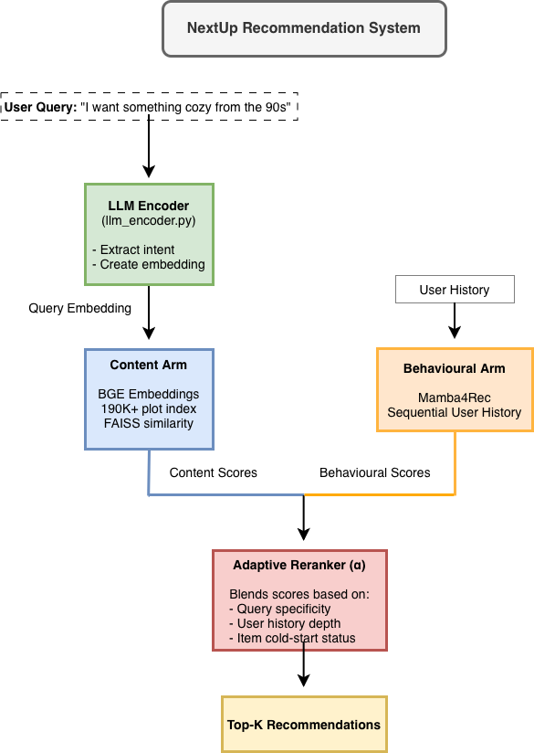

# NextUp Recommender System

Imagine you’re sitting down to watch a movie at the end of a long day. You open one streaming service after the other, scrolling through an endless array of posters and trailers. An hour has passed, and you still haven’t found what you’re looking for. 
Imagine instead that you sit down and open an app, an app that can recommend movies across multiple streaming services all in one place. Imagine this app has a chatbot, where you can type a prompt describing what you’re currently in the mood to watch, e.g. “I’m looking for a cozy movie from the early 2000s”, “I want to watch a 90s thriller with Morgan Freeman in it”, or “Looking for something short and cheerful”. Then imagine, the app recommends exactly what you’re looking for. That’s the power of the NextUp Recommender System.
 
Modern day movie recommender systems operate within streaming service echo chambers and leave no room for meaningful user input on what they are in the mood to watch in the current session. The NextUp movie recommendation system puts users back in the driving seat. By combining cutting-edge sequential modeling with intelligent content understanding, NextUp delivers personalized, mood-aware recommendations through natural language interaction.

## The Problem

Traditional recommendation systems face two critical challenges:
1. **Loss of user agency**: Users are passive recipients of algorithmic predictions rather than active participants
2. **Cold-start problem**: New movies can't be recommended until users interact with them


NextUp addresses both through a novel dual-arm architecture that blends behavioral signals with semantic content understanding.

## Overview

NextUp implements a **dual-arm recommendation architecture** that intelligently combines two complementary approaches:

### Behavioral Arm (Mamba4Rec)
Learns from user interaction histories using **Mamba4Rec**, a cutting-edge sequential recommendation model based on Selective State Space Models (SSMs). Unlike Transformer-based approaches that suffer from quadratic computational complexity, Mamba4Rec efficiently handles long user behavior sequences with linear complexity—making it ideal for real-world production systems.

> **Why Mamba4Rec?** Published in March 2024 and awarded Best Paper at RelKD@KDD 2024, Mamba4Rec is the first work to apply selective SSMs to sequential recommendation. It outperforms both RNN and attention-based models in effectiveness and efficiency, especially for long interaction sequences.

### Content Arm (Semantic Search)
Uses **BAAI/bge-large-en-v1.5** embeddings and FAISS vector indexing over **190,000+ Wikipedia movie plots** to enable semantic search based on user queries like "something cozy and nostalgic from the early 2000s."

## Intelligent Blending Layer
A reranker dynamically blends behavioral and content signals based on query specificity:
- More specific mood/genre queries → Higher weight on content arm
- General browsing → Higher weight on behavioral arm (user interaction history)
- Cold-start items → Surfaced through content arm, graduated into behavioral catalog

## Key Features

### User-Driven Recommendations
Natural language queries for mood, genre, era, and constraints put users in control rather than forcing them to passively consume algorithmic suggestions.

### Cold-Start Solution
New movies are immediately recommendable through semantic plot similarity, then "graduate" into the behavioral model's catalog as users interact with them.

### Group-Watch Blending
Intelligently merges multiple user profiles for shared viewing experiences—perfect for couples, families, or watch parties.

### Production-Ready Design
- RESTful API architecture for frontend integration
- Efficient data pipelines for plot extraction and encoding
- Scalable vector storage (in-memory for dev, Redis/PostgreSQL for production)
- Modular design supporting pluggable embedding stores

## Architecture



## Dataset & Scale

- **Behavioral Training**: MovieLens-32M (32 million ratings, 162,000 movies)
- **Content Search**: 190,000+ Wikipedia movie/TV plot summaries encoded with BGE-large embeddings
- **Content Pipeline**: Automated Wikidata SPARQL filtering → Wikipedia plot extraction → BGE encoding with caching
- **Graduation Pipeline** (planned): Designed to track when movies accumulate sufficient user interactions to "graduate" from content-only recommendations into the behavioral arm's training catalog. Upon reaching threshold, the system will trigger Mamba4Rec retraining with the expanded dataset, enabling continuous evolution as users discover new content.

## Installation

### Using Conda (Recommended)

```bash
conda env create -f environment.yaml
conda activate nextup-recommender-system
```

### Using UV

```bash
uv sync
```

### Using pip

```bash
pip install -e .

# For GPU support (Linux only)
pip install -e ".[gpu]"

# For data pipeline
pip install -e ".[data]"

# For production storage backends
pip install -e ".[redis]"
```

## Quick Start

### 1. Train the Behavioral Arm

```bash
python train.py --config config_ml32m.yaml --save_dir ./checkpoints
```

### 2. Build the Content Index

```bash
# Run the data pipeline to extract and encode plots
python pipeline/run_pipeline.py --output ./data/plots.parquet

# Build FAISS index
python -c "from content_tower import ContentTower; tower = ContentTower(); tower.build_index()"
```

### 3. Serve Recommendations (API)

```python
from inference import RecommendationEngine

engine = RecommendationEngine.load("./checkpoints/mamba_trained.pt")

# Single user recommendation
result = engine.recommend(
    user_id=12345,
    query="I want something cozy and nostalgic from the 90s",
    top_k=10
)

# Group-watch blending
result = engine.recommend_group(
    user_ids=[12345, 67890],
    query="family-friendly comedy",
    top_k=10
)
```

## Project Status

**In Active Development**

This project is currently under development as part of a research initiative to push the boundaries of recommendation system design. Core components implemented:

- [x] Mamba4Rec behavioral model (stripped fusion, pure sequential)
- [x] Wikipedia plot extraction pipeline (190K+ encoded)
- [x] BGE-based content tower with FAISS indexing
- [x] Intent parsing for mood/genre/era extraction
- [x] Reranker with adaptive blending
- [x] Group-watch blending with fairness-weighted aggregation
- [ ] API integration layer (in progress)
- [ ] Graduation mechanism (cold-start → behavioral catalog)
- [ ] End-to-end evaluation and benchmarking

## Technical Highlights

### Why Dual-Arm Architecture?

Traditional approaches force a tradeoff:
- **Collaborative filtering alone**: Can't recommend new items (cold-start), can’t adapt to user’s current mood and intent
- **Content-based alone**: Can’t personalize based on historical user behaviour patterns 

The dual-arm approach leverages the strengths of each approach through intelligent blending.

### Why Mamba over Transformers?

| Model Type | Complexity | 100 Items | 1000 Items | 10,000 Items |
|------------|------------|-----------|------------|--------------|
| Transformer | O(n²) | Fast | Slower | Very slow |
| Mamba4Rec | O(n) | Fast | Fast | Fast |

While Transformers excel in many domains, their quadratic attention complexity means inference time and memory grow dramatically with sequence length. For sequential recommendation where power users may have 1000+ interaction histories, Mamba4Rec's linear scaling provides significant efficiency gains while maintaining competitive accuracy. This matters for real-time recommendation serving at scale.

### Adaptive Blending (α Parameter)

Adaptive blending allows the system to rely on the respective strengths of the behavioural and content arms depending on the situation.

The reranker computes a dynamic blending weight α ∈ [0,1]:
- High specificity query ("cyberpunk thriller from 2019") → α → 0.8 (favor content)
- General query ("something good") → α → 0.3 (favor behavioral)
- Cold-start item → Boosted through content arm, flagged for graduation

## Project Structure

```
nextup-recommender-system/
├── mamba4rec.py           # Core Mamba sequential model
├── content_tower.py       # BGE embedding + FAISS search
├── reranker.py            # Adaptive blending logic
├── llm_encoder.py         # Intent parsing from natural language
├── embedding_store.py     # Pluggable storage (in-memory/Redis)
├── inference.py           # Recommendation API orchestrator
├── train.py               # Single-phase Mamba training
├── graduation.py          # Cold-start → behavioral catalog promotion
├── chat_provider.py       # LLM chat providers for conversational interface
├── pipeline/              # Data pipeline for plot extraction
│   ├── download.py        # Wikipedia dump downloader
│   ├── extract_plots.py   # Plot text extraction
│   ├── filter_plots.py    # Wikidata SPARQL filtering (movies/TV only)
│   ├── encode_plots.py    # BGE encoding with caching
│   └── join_movielens.py  # Bridge MovieLens IDs to Wikipedia
└── tests/                 # Comprehensive test suite
```

## Development

### Running Tests

```bash
pytest tests/ -v
```

### Code Quality

```bash
ruff check .
ruff format .
```

## Requirements

- Python 3.10+ (3.11 recommended)
- PyTorch >= 2.0.0
- RecBole >= 1.1.1
- sentence-transformers >= 2.2.0
- faiss-cpu >= 1.7.0
- mamba-ssm >= 1.0.0 (Linux + CUDA only, optional)

## Roadmap

- [ ] Complete API integration layer
- [ ] Implement group-watch profile blending
- [ ] Build graduation mechanism (content → behavioral)
- [ ] End-to-end evaluation on MovieLens-32M
- [ ] Benchmark against Transformer baselines
- [ ] Deploy demo application
- [ ] Production-ready deployment guide

## Citation

This project builds upon Mamba4Rec:

```bibtex
@article{liu2024mamba4rec,
  title={Mamba4Rec: Towards Efficient Sequential Recommendation with Selective State Space Models},
  author={Liu, Chengkai and Lin, Jianghao and Wang, Jianling and Liu, Hanzhou and Caverlee, James},
  journal={arXiv preprint arXiv:2403.03900},
  year={2024}
}
```

## Acknowledgments

- [Mamba4Rec](https://github.com/chengkai-liu/Mamba4Rec) for the sequential recommendation foundation
- [RecBole](https://recbole.io/) for the recommendation framework
- [BAAI](https://huggingface.co/BAAI) for the BGE embedding models
- Built with AI-assisted development workflows, utilizing Claude (LLM) from Anthropic to enhance productivity and documentation quality

---

**Note**: This is a research and development project. Code and documentation are actively evolving. Contributions and feedback welcome!
